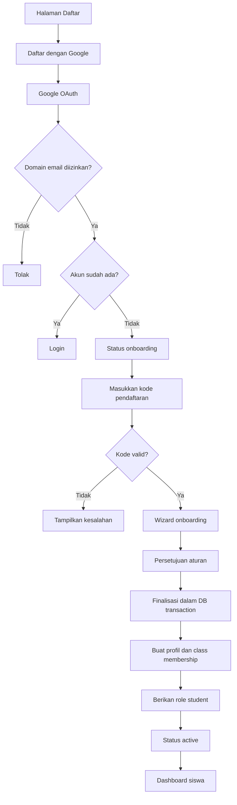
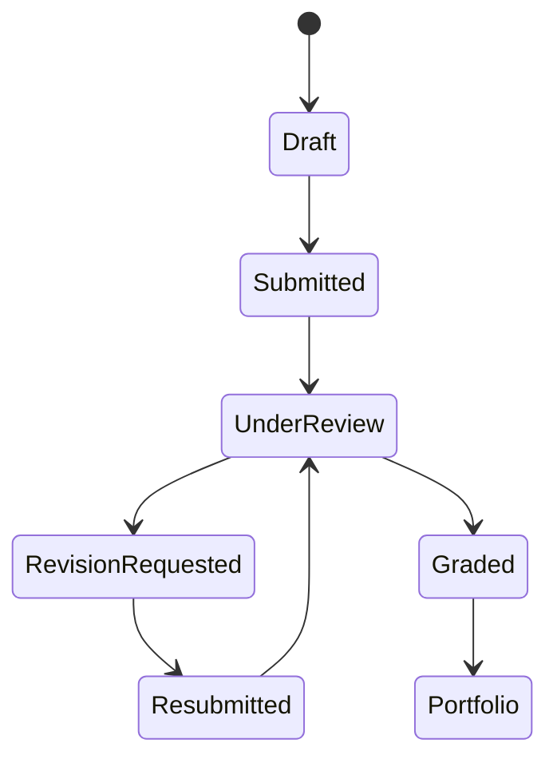
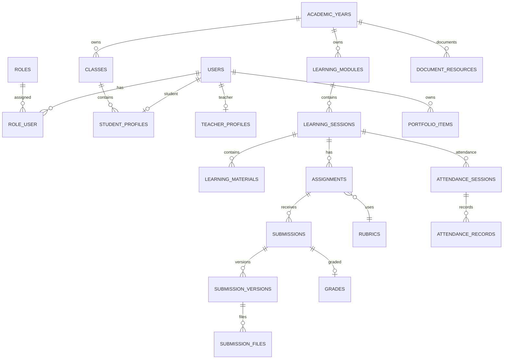

# BLUEPRINT SUPER PREMIUM — SKUAD LEARNING HUB

> Sistem Pembelajaran, Administrasi, Penilaian, dan Portofolio Digital  
> SMP IT Mentari Ilmu Jatisari

## 0. Identitas Proyek

| Item | Keterangan |
|---|---|
| Nama aplikasi | SKUAD Learning Hub |
| Program | SKUAD — Siswa Kreatif Update Digital |
| Instansi | SMP IT Mentari Ilmu Jatisari |
| Pembina | Andi Apriandi, S.T. |
| Struktur belajar | 15 modul, 30 pertemuan |
| Durasi | 90 menit per pertemuan, total 45 jam |
| Bahasa UI | Bahasa Indonesia |
| Zona waktu | Asia/Jakarta |
| Target perangkat | Desktop, tablet, ponsel |
| Pengembangan | Visual Studio Code + Codex |

---

# 1. Stack Teknologi yang Dikunci

## Frontend

- HTML5
- CSS3
- JavaScript murni
- Bootstrap 5
- Bootstrap Icons
- Blade Templates
- Vite

## Backend

- PHP
- Laravel 12 jika PHP dan Composer mendukung
- Laravel Socialite untuk autentikasi Google
- Laravel Policies untuk otorisasi
- Laravel Form Request untuk validasi
- Laravel Storage untuk file privat
- Laravel Notifications untuk notifikasi aplikasi

## Database

- MySQL atau MariaDB yang kompatibel
- Seluruh tabel dibuat melalui migration
- Dilarang membuat tabel aplikasi langsung melalui phpMyAdmin

## Paket Tambahan

Hanya boleh ditambahkan bila fase terkait dimulai dan disetujui:

- `laravel/socialite` untuk login Google
- Paket PDF untuk laporan PDF
- Paket spreadsheet untuk ekspor Excel

Codex tidak boleh memasang package lain tanpa alasan tertulis dan persetujuan.

---

# 2. Visi Produk

SKUAD Learning Hub menyatukan:

1. Pendaftaran siswa dengan akun Google/Gmail.
2. Form onboarding siswa sebelum menjadi anggota aktif.
3. Akun siswa yang otomatis memperoleh role `student` setelah proses valid.
4. Dashboard pribadi siswa.
5. Dashboard pembina dan kepala sekolah.
6. Materi 30 pertemuan.
7. Presensi siswa.
8. Absen pengajar SKUAD.
9. Tugas, revisi, rubrik, nilai, dan remedial.
10. Portofolio digital siswa.
11. Catatan penting ekskul.
12. Silabus, Modul, Asesmen, RPP, Kurikulum, dan dokumen lain melalui URL Google Drive.
13. Laporan kegiatan dan perkembangan siswa.

Aplikasi harus terasa modern, premium, bersih, cepat, dan ramah siswa SMP.

---

# 3. Prinsip Produk

## Mudah Dipahami

- Bahasa sederhana.
- Navigasi maksimal dua tingkat.
- Satu halaman memiliki satu tujuan utama.
- Tombol tindakan utama selalu terlihat.

## Aman untuk Siswa

- Siswa wajib login Google.
- Tidak ada chat pribadi antarsiswa pada MVP.
- File siswa bersifat privat.
- Policies diterapkan pada semua resource.
- Perubahan nilai, tanda tangan, kehadiran, role, dan publikasi masuk audit log.

## Mobile First

- Seluruh fitur utama dapat digunakan dari ponsel.
- Tabel diubah menjadi kartu pada ponsel jika perlu.
- Touch target minimal 44×44 piksel.
- Form onboarding dibuat wizard.

## Berbasis Proses

- Tugas mendukung draf, submit, review, revisi, dan versi final.
- Guru menilai menggunakan rubrik.
- Portofolio menampilkan proses dan hasil.

---

# 4. Pendaftaran Siswa Wajib Google/Gmail

## Konfigurasi Awal

```env
STUDENT_REGISTRATION_GOOGLE_ONLY=true
STUDENT_ALLOWED_EMAIL_DOMAINS=gmail.com
STUDENT_REGISTRATION_REQUIRE_JOIN_CODE=true
STUDENT_AUTO_ACTIVATE_AFTER_ONBOARDING=true
```

Domain dapat diperluas untuk Google Workspace sekolah.

## Alur Pendaftaran



## Kode Pendaftaran

Kode mencegah orang luar mendaftar hanya dengan Gmail. Kode mendukung:

- Tahun ajaran.
- Kelas opsional.
- Gelombang.
- Masa aktif.
- Batas penggunaan.
- Status aktif/nonaktif.

## Wizard Onboarding 5 Langkah

### Langkah 1 — Identitas

- Nama lengkap.
- Nama panggilan.
- Nomor induk siswa.
- NISN opsional.
- Jenis kelamin.
- Tanggal lahir.
- Kelas.
- Foto profil Google.

### Langkah 2 — Orang Tua/Wali

- Nama wali.
- Nomor telepon wali.
- Hubungan dengan siswa.
- Alamat singkat opsional.
- Kontak darurat opsional.

### Langkah 3 — Perangkat dan Internet

- Ponsel Android/iPhone.
- Laptop/komputer.
- Tidak memiliki perangkat pribadi.
- Akses internet: stabil, terbatas, paket data, tidak tersedia.
- Kesediaan menggunakan perangkat kelompok.
- Aplikasi yang pernah digunakan.

### Langkah 4 — Minat dan Kemampuan Awal

- Desain grafis.
- Fotografi.
- Videografi.
- Presentasi.
- AI.
- Coding.
- Data.
- Kewirausahaan digital.
- Pengalaman proyek.
- Harapan.
- Target keterampilan.

### Langkah 5 — Persetujuan

- Tata tertib.
- Etika komunikasi.
- Privasi.
- Aturan AI.
- Aturan publikasi karya.
- Konfirmasi kebenaran data.

## Status Akun Siswa

```text
onboarding
active
suspended
graduated
archived
```

---

# 5. Role dan Hak Akses

## Super Admin

- Semua akses.
- Role, konfigurasi, audit, backup, kode pendaftaran.

## Admin Sekolah

- Siswa, staff, kelas, tahun ajaran, impor, laporan administrasi.

## Pembina/Guru SKUAD

- Siswa, onboarding, materi, presensi, absen pengajar, tugas, nilai, remedial, portofolio, dokumen Drive, catatan penting, laporan.

## Coach

- Monitoring siswa dan proyek.
- Mengisi penyelesaian catatan.
- Paraf coach.

## Siswa

- Dashboard pribadi.
- Profil.
- Materi.
- Tugas dan revisi.
- Nilai dan feedback.
- Kehadiran pribadi.
- Portofolio.
- Pengumuman.
- Dokumen yang diizinkan.

## Kepala Sekolah

- Dashboard monitoring.
- Kehadiran siswa.
- Absen pengajar.
- Nilai.
- Catatan penting.
- Dokumen kurikulum.
- Laporan.

---

# 6. Dashboard Siswa

## Hero

- Avatar.
- Sapaan.
- Nama dan kelas.
- Status siswa.
- Progress 30 pertemuan.

## Kartu Ringkasan

- Pertemuan selesai.
- Tugas aktif.
- Tugas perlu revisi.
- Rata-rata nilai.
- Persentase kehadiran.
- Jumlah karya portofolio.

## Konten Utama

- Lanjutkan belajar.
- Tugas terdekat.
- Nilai terbaru.
- Perlu revisi.
- Kehadiran saya.
- Portofolio pilihan.
- Pengumuman.

Aturan: siswa hanya boleh melihat data miliknya.

---

# 7. Dashboard Pembina

## KPI

- Siswa aktif.
- Pendaftaran baru.
- Onboarding belum lengkap.
- Pertemuan selesai.
- Tugas belum dinilai.
- Revisi belum dikerjakan.
- Kehadiran rata-rata.
- Catatan penting terbuka.
- Absen pengajar menunggu verifikasi.

## Siswa Perlu Perhatian

- Kehadiran rendah.
- Banyak tugas terlambat.
- Tugas tidak dikumpulkan.
- Nilai menurun.
- Revisi belum selesai.

## Aksi Cepat

- Buka pertemuan.
- Isi absen pengajar.
- Ambil presensi.
- Buat tugas.
- Nilai pengumpulan.
- Tambah dokumen Drive.
- Buat catatan penting.

## Grafik

- Kehadiran.
- Penyelesaian tugas.
- Distribusi nilai.
- Capaian kompetensi.
- Progress 30 pertemuan.

---

# 8. Pusat Dokumen Google Drive

Pembina mengunggah file ke Google Drive dan memasukkan URL ke aplikasi.

## Kategori

```text
silabus
modul
asesmen
rpp
kurikulum
alat_dan_bahan
buku_teori
form_administrasi
panduan
lainnya
```

## Field

- Judul.
- Kategori.
- Deskripsi.
- URL Google Drive.
- Drive file ID hasil parsing jika valid.
- Preview URL.
- Tahun ajaran.
- Semester.
- Audience.
- Urutan.
- Pin.
- Status aktif.
- Tanggal publikasi.
- Dibuat/diperbarui oleh.

## Audience

```text
staff_only
teacher_coach
all_staff
students
internal_public
```

## Fitur

- CRUD URL.
- Validasi URL.
- Preview modal.
- Buka tab baru.
- Salin tautan.
- Filter kategori.
- Pencarian.
- Pin.
- Arsip.
- Riwayat perubahan.
- Pesan jika izin Drive tidak tersedia.

Aplikasi tidak mengubah izin Drive. Pembina harus memastikan sharing sesuai audience dan menggunakan akses Viewer.

---

# 9. Modul Pembelajaran

- 15 modul.
- 30 pertemuan.
- 15 pertemuan semester 1.
- 15 pertemuan semester 2.
- 90 menit per pertemuan.

Isi pertemuan:

- Judul dan nomor.
- Modul.
- Tujuan.
- Teori.
- Media.
- Rangkuman.
- Latihan.
- Tugas praktik.
- Refleksi.
- Dokumen pendukung.

Status:

```text
draft
scheduled
published
ongoing
completed
archived
```

Progress dihitung dari materi dibuka, latihan, tugas, dan refleksi; bukan hanya login.

---

# 10. Tugas dan Revisi

## Jenis

- Teks.
- Dokumen.
- Gambar.
- Video URL.
- Link karya.
- Campuran.
- Individu.
- Kelompok.
- Refleksi.

## Workflow



Status:

```text
draft
submitted
late
under_review
revision_requested
resubmitted
graded
```

Setiap submit ulang membuat versi baru.

---

# 11. Penilaian

## Capaian

```text
1 — Perlu Pendampingan
2 — Berkembang
3 — Terampil
4 — Kreator Mandiri
```

## Komponen

- Pemahaman.
- Proses.
- Kreativitas.
- Teknis.
- Kolaborasi.
- Presentasi.
- Etika dan keamanan.
- Refleksi dan revisi.

## Guru

- Rubrik reusable.
- Bobot.
- Skor per kriteria.
- Feedback.
- Catatan privat.
- Publikasi nilai.
- Remedial.
- Audit perubahan.

## Siswa

- Nilai setelah publish.
- Skor kriteria.
- Feedback.
- Revisi.
- Tambahkan karya final ke portofolio.

---

# 12. Presensi Siswa

Status:

```text
present
late
sick
permitted
absent
```

Pembina dapat membuka sesi, input massal, menggunakan tombol besar di ponsel, memberi catatan, menutup sesi, dan mencetak rekap.

Siswa melihat riwayat dan persentase pribadi.

---

# 13. Absen Pengajar

Field:

- Nomor otomatis.
- Tanggal.
- Materi.
- Kegiatan.
- Penugasan.
- Tanda tangan.

Status:

```text
draft
submitted
verified
rejected
```

Fitur:

- Draf.
- Tanda tangan digital.
- Kunci setelah submit.
- Verifikasi/penolakan.
- Catatan penolakan.
- Cetak A4.
- Rekap bulanan.
- Audit log.

---

# 14. Catatan Penting

Field:

- Tanggal.
- Catatan khusus.
- Penyelesaian.
- Prioritas.
- Status.
- Paraf coach.
- Paraf pembina.

Status:

```text
open
in_progress
resolved
verified
```

Prioritas:

```text
low
medium
high
urgent
```

---

# 15. Portofolio Siswa

Jenis karya:

- Poster.
- Infografis.
- Foto.
- Video.
- Presentasi.
- Laporan.
- Coding.
- Website.
- Katalog.
- Proyek akhir.
- Sertifikat.

Visibility:

```text
private
teacher_only
class
school
public_approved
```

Fitur:

- Thumbnail.
- Deskripsi.
- Versi awal/final.
- Refleksi.
- Nilai.
- Feedback.
- Sumber.
- Deklarasi AI.
- Featured item.
- Persetujuan publikasi.

---

# 16. Navigasi

## Pembina

```text
Dashboard
Akademik
├── Tahun Ajaran
├── Kelas
├── Siswa
├── Pendaftaran
└── Kode Pendaftaran
Pembelajaran
├── Modul
├── Pertemuan
├── Materi
├── Tugas
└── Dokumen Drive
Kehadiran
├── Presensi Siswa
├── Absen Pengajar
└── Rekap
Penilaian
├── Pengumpulan
├── Rubrik
├── Nilai
├── Remedial
└── Portofolio
Interaksi
├── Pengumuman
├── Diskusi
├── Kelompok Proyek
└── Catatan Penting
Laporan
```

## Siswa

```text
Beranda
Belajar
Tugas
Nilai
Portofolio
Kehadiran
Pengumuman
Profil
```

Bottom navigation ponsel:

```text
Beranda | Belajar | Tugas | Portofolio | Profil
```

---

# 17. UI Super Premium

## Design Tokens

```css
:root {
  --skuad-navy-950: #071827;
  --skuad-navy-900: #0B2239;
  --skuad-navy-800: #123654;
  --skuad-teal-600: #0F9F96;
  --skuad-teal-500: #14B8A6;
  --skuad-cyan-400: #22D3EE;
  --skuad-orange-500: #F59E0B;
  --skuad-surface: #F5F7FA;
  --skuad-card: #FFFFFF;
  --skuad-text: #14212B;
  --skuad-muted: #64748B;
  --skuad-border: #E2E8F0;
  --skuad-success: #16A34A;
  --skuad-warning: #D97706;
  --skuad-danger: #DC2626;
}
```

## Tipografi

- Heading: Plus Jakarta Sans.
- Body: Inter.
- Fallback: system-ui, Arial, sans-serif.

## Bentuk

| Komponen | Gaya |
|---|---|
| Card | radius 20 px |
| Button | radius 12 px |
| Input | tinggi 46–50 px |
| Modal | radius 24 px |
| Badge | pill |
| Sidebar | floating/inset |
| Shadow | lembut |
| Animasi | 160–220 ms |
| Ikon | Bootstrap Icons |

## Aturan

- Banyak ruang kosong.
- Gradient hanya untuk hero/login.
- Warna status konsisten.
- Sticky header pada tabel.
- Skeleton loading.
- Empty state memberi arahan.
- Delete dengan confirmation modal.
- Tidak ada hover-only action.

---

# 18. Responsive

## Desktop ≥1200 px

- Sidebar 280 px, collapse 84 px.
- Grid 12 kolom.
- 4 KPI per baris.
- Tabel penuh.
- Detail side panel.

## Tablet 768–1199 px

- Sidebar offcanvas.
- Grid 2 kolom.
- Form 1–2 kolom.
- Tabel scroll.

## Mobile <768 px

- Satu kolom.
- Bottom navigation.
- Tabel menjadi card.
- Filter offcanvas.
- Sticky submit bar.
- Onboarding satu langkah per layar.
- Tanda tangan full width.

---

# 19. Halaman

## Public

- Landing.
- Login.
- Daftar Google.
- Error OAuth.
- Validasi kode.
- Onboarding.
- Privasi.
- Tata tertib.

## Siswa

- Dashboard.
- Profil.
- Materi.
- Pertemuan.
- Tugas.
- Pengumpulan.
- Histori revisi.
- Nilai.
- Kehadiran.
- Portofolio.
- Pengumuman.
- Dokumen siswa.

## Pembina

- Dashboard.
- Siswa.
- Detail siswa 360°.
- Pendaftaran.
- Kode.
- Modul.
- Pertemuan.
- Materi.
- Tugas.
- Pengumpulan.
- Grading.
- Presensi.
- Absen pengajar.
- Catatan penting.
- Dokumen Drive.
- Portofolio.
- Laporan.

---

# 20. Struktur Database Inti

## `users`

```text
id
google_id nullable unique
name
email unique
username nullable unique
password nullable
avatar_path nullable
email_verified_at nullable
status
last_login_at nullable
remember_token
timestamps
soft_deletes
```

## `roles`, `role_user`

Role: super-admin, admin, teacher, coach, student, principal.

## `registration_codes`

```text
id
academic_year_id
class_id nullable
code_hash/name
max_uses nullable
used_count
starts_at nullable
expires_at nullable
is_active
created_by
timestamps
```

## `student_onboarding_responses`

```text
id
user_id unique
device_access json
internet_access
digital_apps json
interests json
initial_skills json
experience nullable
expectation nullable
learning_targets nullable
agreed_rules_at nullable
agreed_privacy_at nullable
agreed_ai_policy_at nullable
agreed_publication_policy_at nullable
completed_at nullable
timestamps
```

## `student_profiles`

```text
id
user_id unique
student_number unique
nisn nullable unique
nickname nullable
gender nullable
birth_date nullable
class_id
parent_name nullable
parent_phone nullable
guardian_relationship nullable
address nullable
joined_at
membership_status
timestamps
soft_deletes
```

## `academic_years`, `classes`, `class_students`

Master tahun ajaran dan kelas.

## `learning_modules`, `learning_sessions`, `learning_materials`, `student_learning_progress`

Menyimpan 15 modul, 30 pertemuan, materi, dan progress.

## `document_resources`

```text
id
academic_year_id nullable
title
slug
category
description nullable
drive_url
drive_file_id nullable
preview_url nullable
audience
semester nullable
sort_order
is_pinned
is_active
published_at nullable
created_by
updated_by nullable
timestamps
soft_deletes
```

## `attendance_sessions`, `attendance_records`

Presensi per pertemuan.

## `assignments`, `submissions`, `submission_versions`, `submission_files`

Tugas dan histori revisi.

## `rubrics`, `rubric_criteria`, `rubric_levels`, `submission_scores`, `grades`

Penilaian.

## `portfolio_items`

Portofolio dan visibility.

## `teacher_activity_logs`

Absen pengajar.

## `important_notes`

Catatan penting dan paraf.

## `announcements`, `discussion_topics`, `discussion_posts`

Interaksi aman tanpa direct message.

## `activity_logs`

Audit aktivitas penting.

---

# 21. ERD Tingkat Tinggi



---

# 22. Struktur Folder Laravel

```text
app/
├── Actions/
├── Enums/
├── Http/
│   ├── Controllers/{Admin,Teacher,Student,Coach,Principal}
│   ├── Middleware/
│   └── Requests/
├── Models/
├── Notifications/
├── Policies/
├── Services/
└── Support/
database/{factories,migrations,seeders}/
resources/
├── css/{components,pages}/
├── js/{components,pages,utils}/
└── views/{layouts,components,auth,student,teacher,coach,principal,admin}/
routes/{web,auth,student,teacher,coach,principal,admin}.php
tests/{Feature,Unit}/
```

---

# 23. Keamanan

- Verifikasi OAuth state.
- Domain email dikonfigurasi.
- Student role hanya setelah onboarding valid.
- Kode pendaftaran memiliki entropy tinggi dan rate limit.
- Password staff di-hash.
- Google token tidak disimpan jika tidak dibutuhkan.
- Policies dan Form Request wajib.
- DB transaction untuk finalisasi onboarding.
- File siswa/tanda tangan privat.
- Download via controller berpolicy.
- Validasi MIME dan ukuran.
- Cegah IDOR dan akses lintas siswa/kelas.
- Nilai hanya terlihat setelah publish.
- Dokumen mengikuti audience.
- CSRF aktif.
- APP_DEBUG=false pada production.

---

# 24. State UI Wajib

- Loading.
- Empty.
- Error.
- Success.
- Disabled.
- Unauthorized.
- Mobile layout.
- Keyboard focus.

---

# 25. Kriteria Selesai MVP

1. Google registration berjalan.
2. Kode pendaftaran tervalidasi.
3. Onboarding tersimpan.
4. Role student otomatis setelah finalisasi.
5. Dashboard siswa pribadi.
6. Pembina melihat siswa dan progress.
7. 30 pertemuan dapat dikelola.
8. Dokumen Drive dapat ditambah dan dibatasi audience.
9. Presensi berjalan.
10. Absen pengajar berjalan.
11. Tugas, revisi, nilai, remedial, dan portofolio berjalan.
12. UI responsive.
13. Policies dan tests lulus.
14. Production build berhasil.

---

# 26. Fase Pengembangan

1. Audit lingkungan.
2. Laravel 12.
3. Design system.
4. Role dan staff auth.
5. Google OAuth.
6. Kode pendaftaran.
7. Onboarding.
8. Master data.
9. Dashboard siswa.
10. Pembelajaran.
11. Dokumen Drive.
12. Presensi.
13. Absen pengajar dan catatan.
14. Tugas.
15. Nilai.
16. Portofolio.
17. Pengumuman/forum.
18. Dashboard monitoring.
19. Laporan.
20. Responsive polish.
21. Security.
22. Deployment.

---

# 27. Referensi Teknis Resmi

- Laravel 12: https://laravel.com/docs/12.x
- Laravel Authentication: https://laravel.com/docs/12.x/authentication
- Laravel Socialite: https://laravel.com/docs/12.x/socialite
- Laravel Authorization: https://laravel.com/docs/12.x/authorization
- Google Identity: https://developers.google.com/identity
- Google Drive Sharing: https://support.google.com/drive/answer/2494822
